# EVVA

**Corporate website, service platform and smart shop built with PHP and MySQL.**

EVVA brings telecom, internet, energy, smart-home and technology products together in one clear digital experience. The project includes a public website, customer onboarding, a product catalogue, authentication, orders and an administrator backoffice.

[](https://evasive-skier-ended.ngrok-free.dev/home.php)
[](https://www.php.net/)
[](https://www.mysql.com/)
[](https://docs.docker.com/compose/)

> The live demo uses a temporary ngrok tunnel and is available only while the local Docker environment is running.

## Product Story

EVVA helps visitors compare practical solutions, request advice and shop for modern devices through one consistent interface.

- Clear service discovery for telecom, internet, energy, solar panels and smart home
- Dutch and English content using the `lang` query parameter
- Modern product catalogue with categories, brands and product details
- Shopping cart, checkout and order history
- Customer and partner onboarding flows
- Admin tools for managing the catalogue and website content

## Screenshots

### Public Experience

#### Homepage

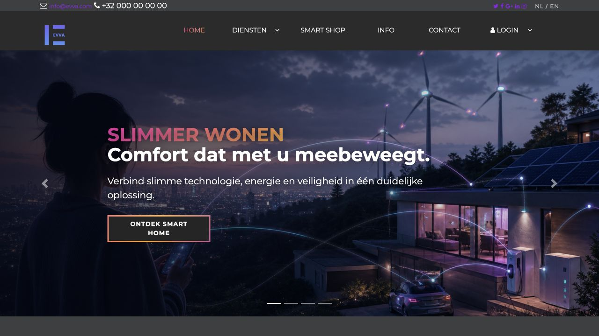

The homepage introduces EVVA through a full-width visual hero, clear navigation and a direct route into smart-home services.

#### Services Overview

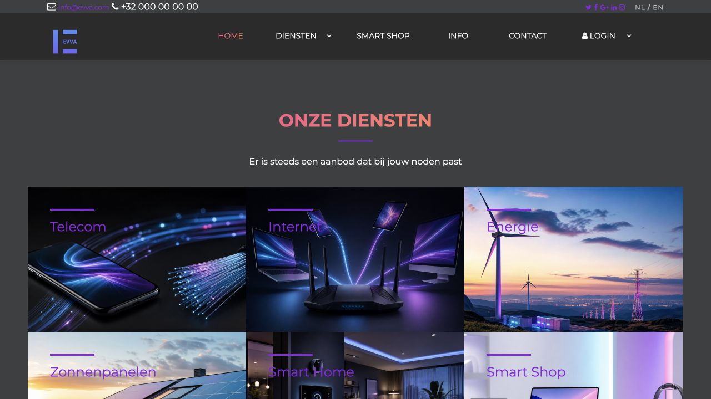

The services overview presents six visual areas: telecom, internet, energy, solar panels, smart home and smart shop.

#### Smart Home Detail

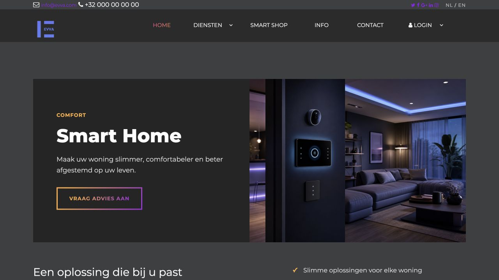

Service detail pages combine a focused value proposition, visual storytelling and a consultation call to action.

### Smart Shop

#### Product Catalogue

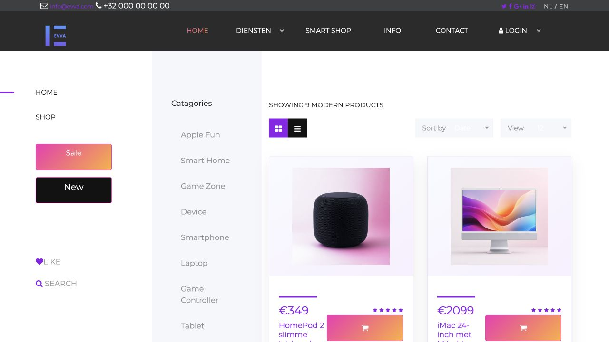

The catalogue supports category navigation, product cards, pricing, ratings and add-to-cart actions.

#### Product Detail

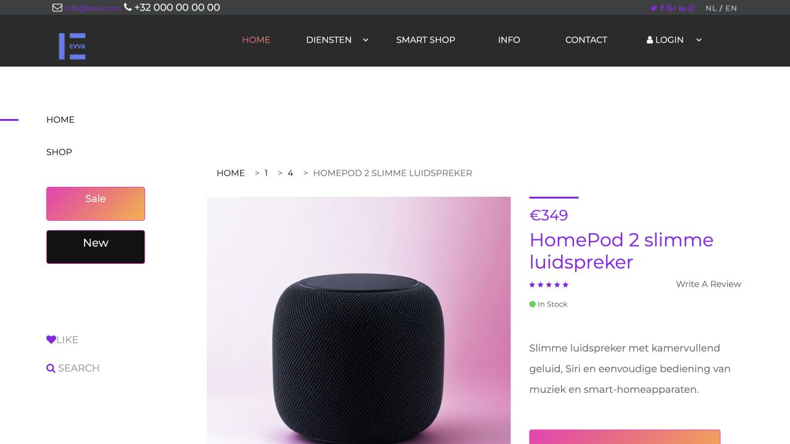

Each product page provides a large product image, price, stock status, rating, description and purchase action.

### Customer Onboarding

#### Become a Customer

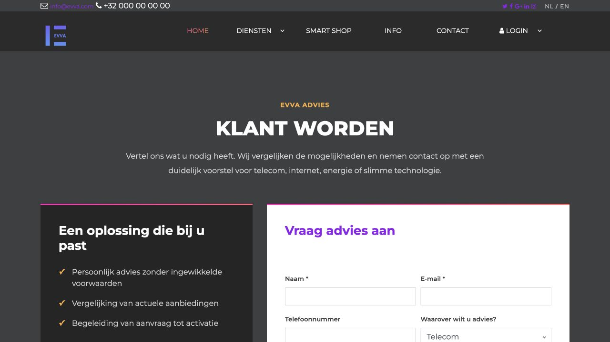

The request flow combines a short explanation of the advisory service with a structured contact form.

### Customer, Cart and Orders

#### Shopping Cart

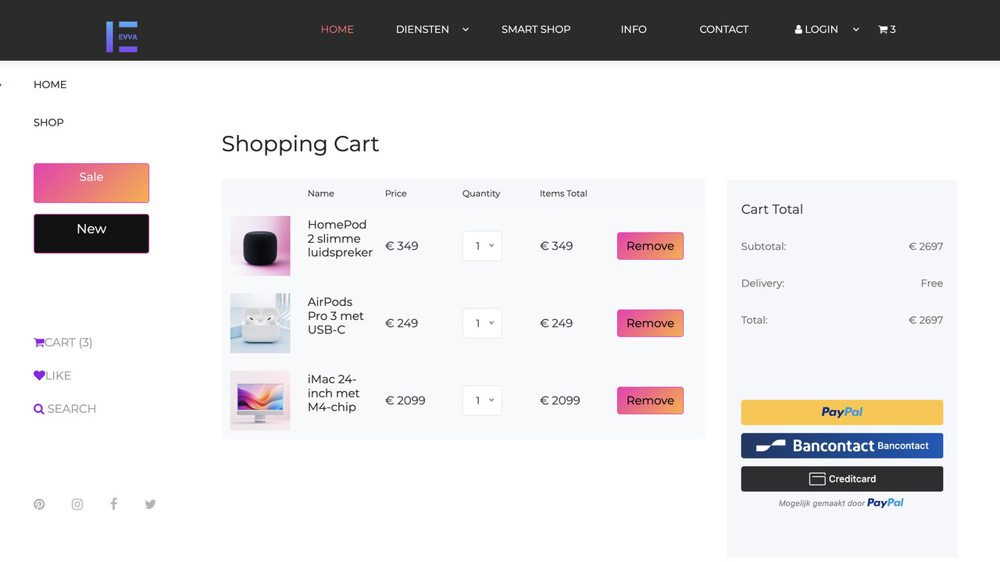

The cart keeps selected products together, shows quantities and totals, and leads into the available checkout options.

#### Order History

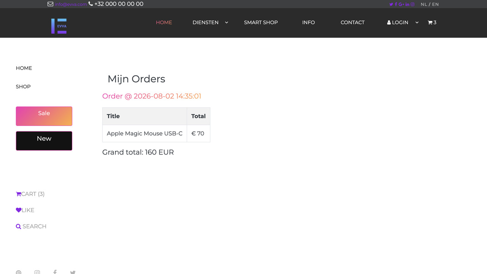

Signed-in customers can review previous orders and their totals from the account area.

### Administration

#### Dashboard

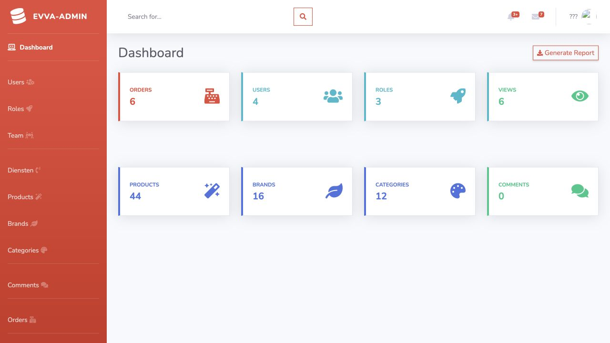

The dashboard gives administrators a compact overview of orders, users, roles, products, brands, categories and comments.

#### Services Management

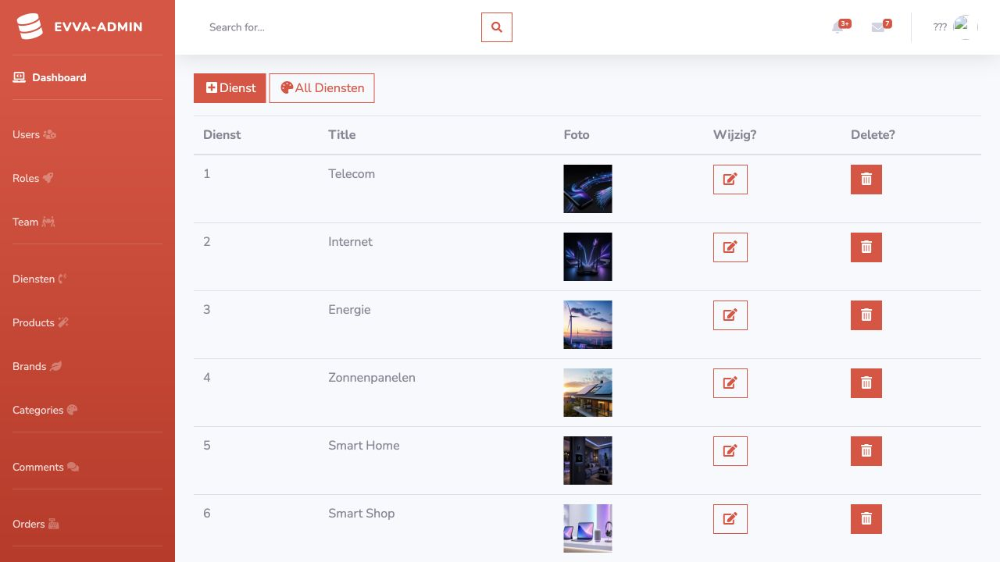

Services can be maintained with their titles and visual media used across the public website.

#### Roles and Access

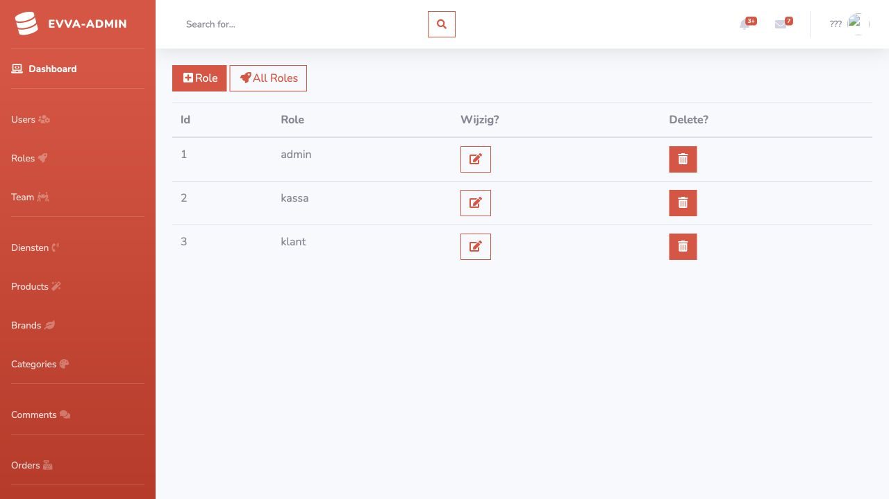

The roles view provides a simple foundation for separating administrator, cashier and customer permissions.

#### Product Management Detail

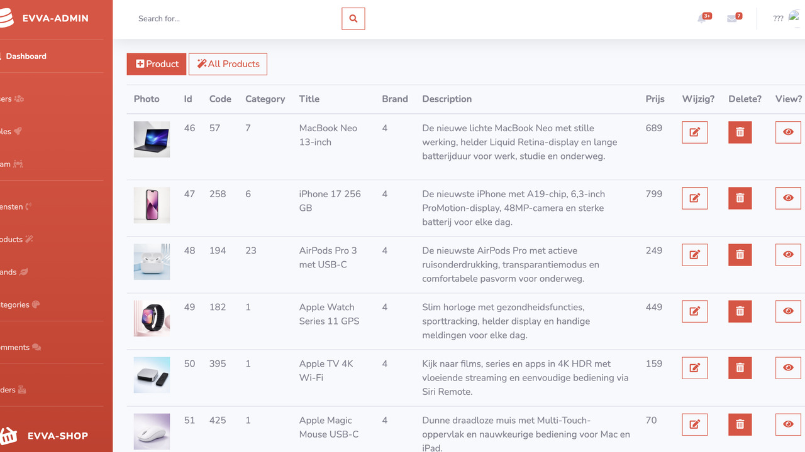

The refreshed catalogue uses current product names, descriptions and imagery for the modern EVVA shop experience.

## Technology

- **Backend:** PHP 8.1 with session-based authentication and server-side workflows
- **Database:** MySQL 8, initialized from `sint.sql`
- **Frontend:** HTML5, CSS3, JavaScript, Bootstrap, jQuery and Owl Carousel
- **Payments:** PayPal REST API in sandbox mode
- **Runtime:** Docker Compose with Apache, PHP and MySQL
- **Admin:** CRUD workflows for users, roles, services, products, brands, categories, comments and orders

## Run Locally

Clone the repository and start the Docker environment:

```bash
git clone https://github.com/ge-lang/evva.git
cd evva
cp .env.example .env
docker compose up -d --build
```

Open the application:

- Website: <http://localhost:8080/home.php>
- Admin area: <http://localhost:8080/admin>
- phpMyAdmin: <http://localhost:8081>

The database is initialized from `sint.sql`. PayPal credentials are optional while the rest of the site is being developed; add sandbox values to `.env` before testing checkout.

## Repository Structure

```text
admin/        Administrator panel and uploaded media
classes/      Shared model and database classes
includes/     Layout, configuration, authentication and payments
css/          Public stylesheets
js/           Public JavaScript
docs/         Project documentation and screenshots
sint.sql      Database schema and catalogue seed data
```

## Security

Never commit `.env`, PayPal secrets, database passwords or personal contact data. Use `.env.example` as the configuration template and keep credentials in local or deployment environment variables.

This is a portfolio and educational project, not a production-ready commerce platform. A production deployment still requires a full security review, stronger password handling, CSRF protection, validation, updated dependencies, transactional payment verification and operational monitoring.

## Project Status

EVVA is the modernized version of an older training project. The original educational archive is preserved separately in [`ge-lang/sint`](https://github.com/ge-lang/sint).
